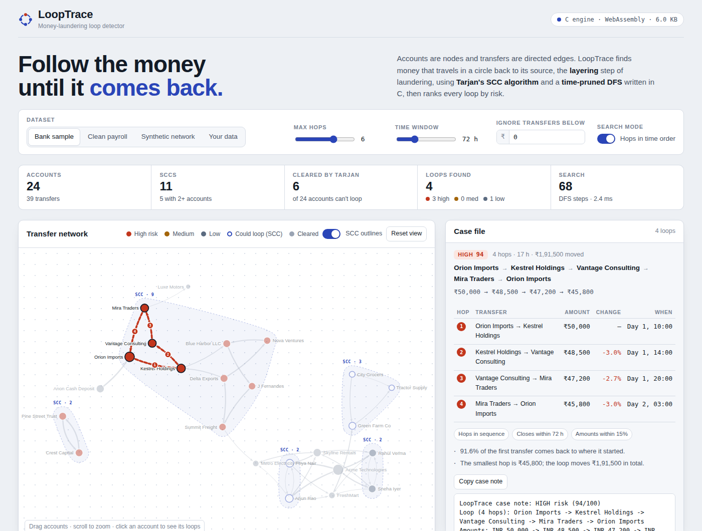

# LoopTrace

**Detecting money-laundering loops in a transaction graph, written in C.**

Bank accounts are nodes and transfers are directed edges. LoopTrace finds money that travels in a circle back to the account it started from. This is the *layering* step of money laundering. It uses **Tarjan's strongly connected components algorithm** and a **time-pruned depth-first search**, then ranks every loop with a 0–100 risk score.

The same C engine runs as a command-line tool and, compiled to WebAssembly, inside an interactive website.

**Live demo: [shivam-pandyacoder24.github.io/looptrace](https://shivam-pandyacoder24.github.io/looptrace/)**



---

## Contents

- [What it does](#what-it-does)
- [How it works](#how-it-works)
- [Project structure](#project-structure)
- [Run it on your computer](#run-it-on-your-computer)
- [Deploy the website](#deploy-the-website)
  - [Before you deploy: put your name on it](#before-you-deploy-put-your-name-on-it)
  - [Option 1: GitHub Pages](#option-1-github-pages-recommended)
  - [Option 2: Netlify](#option-2-netlify)
  - [Option 3: Vercel](#option-3-vercel)
- [Use your own data](#use-your-own-data)
- [Rebuild the website after changing the C code](#rebuild-the-website-after-changing-the-c-code)
- [Questions you may be asked in a viva or interview](#questions-you-may-be-asked-in-a-viva-or-interview)
- [Ideas for extending it](#ideas-for-extending-it)

---

## What it does

Given a list of transfers (`from, to, amount, time`), LoopTrace:

1. Builds a directed graph of accounts.
2. Clears every account that money can never return to, in one linear pass.
3. Finds every loop of 2 to 8 hops inside the remaining groups.
4. Scores each loop on the signals investigators look for:
   - the money keeps most of its value
   - the hops happen one after another
   - the whole loop closes quickly
5. Prints a report (CLI) or shows it on an interactive graph (website).

Sample run on `data/sample.csv`:

```
LoopTrace - money-laundering loop detector
==========================================
Accounts   : 24
Transfers  : 39
SCCs       : 11 total, 5 with more than one account
Search     : 68 DFS steps, 0.01 ms

Loops found: 4  (3 high risk, 0 medium, 1 low)

 1. HIGH    94/100  4 hops  [ordered, fast, similar amounts]
    Orion Imports -> Kestrel Holdings -> Vantage Consulting -> Mira Traders -> Orion Imports
    amounts: 50,000 > 48,500 > 47,200 > 45,800   span: 17.0h
```

All account names in the sample data are fictional.

---

## How it works

### 1. Build the graph: adjacency list in arrays

Each transfer is pushed onto the front of its sender's linked list in O(1). There is no `malloc`: the whole graph lives in one struct of fixed-size arrays (`FraudGraph` in `src/fraud.h`). That is what lets the exact same file compile for the browser without a C library.

### 2. Find strongly connected components: Tarjan's algorithm, O(V + E)

Money can only come back to an account if the account is in a strongly connected component (SCC) with at least one other account. Tarjan's algorithm finds every SCC in a single DFS. Every account that sits alone in its SCC is cleared immediately, with no further search.

### 3. Enumerate loops: depth-limited DFS with pruning

Inside each SCC, a DFS looks for paths that return to the start:

- **No duplicates.** A search only starts from the smallest account id in a loop and only visits larger ids. Each loop is therefore found exactly once, not once per rotation.
- **Depth limit.** Loops longer than `--max-len` hops are not followed.
- **Time pruning (default).** A branch is cut as soon as its hops span more than the time window, or the time goes backwards more than once. A loop whose hops happen in order can only "wrap around" in time once, where the last hop returns to the first.
- **Fair step budget.** The total work is capped at 3 million steps and shared between start accounts, so one dense corner of the graph can't starve the rest.

Why the pruning matters, measured on 1,000 accounts, 7,883 transfers and 20 hidden rings (`tools/gen_data.c`):

| Search mode | DFS steps | Hidden rings found |
|---|---:|---:|
| Any order | 1,496,135 (limit reached) | 19 of 20 |
| Hops in time order (default) | 84,771 | 20 of 20, ranked 1st to 20th |

### 4. Score and rank: heap sort, O(C log C)

| Signal | Points | Why |
|---|---:|---|
| Amount kept | 0–45 | smallest hop ÷ largest hop. Laundered money keeps most of its value. |
| Timing | 0–35 | hops in sequence; full points if the loop closes inside the window |
| Shape | 5–20 | 3–5 hops is typical layering; 2-hop round trips are often refunds |
| Volume | × 0.4–1.0 | the loop's smallest hop compared with the largest transfer in the data |

70 and above is **high** risk, 40–69 **medium**, below 40 **low**. Loops are sorted with a hand-written heap sort.

### Data structures used

| Where | Structure | Cost |
|---|---|---|
| Transfers | adjacency list (array-backed linked lists) | O(1) insert |
| Account names → ids (CLI) | hash table, open addressing, linear probing, djb2 hash | O(1) average |
| SCCs | Tarjan's algorithm with an explicit stack | O(V + E) |
| Loops | depth-limited DFS with backtracking | bounded by max hops and step budget |
| Ranking | binary heap (heap sort) | O(C log C) |

---

## Project structure

```
looptrace/
├── src/
│   ├── fraud.h         engine API and data structures
│   ├── fraud.c         graph, Tarjan's SCC, cycle search, scoring, heap sort
│   ├── namemap.h/.c    hash table: account name -> id
│   ├── main.c          command-line tool (reads CSV, prints report)
│   └── wasm_api.c      exports the engine to JavaScript (WebAssembly build)
├── tests/
│   └── test_fraud.c    unit tests (31 checks)
├── tools/
│   ├── gen_data.c      synthetic data generator with planted rings
│   └── build_web.py    bundles the website into docs/index.html
├── data/
│   ├── sample.csv      bank sample with 3 planted laundering patterns
│   └── clean.csv       ordinary payroll week (no laundering)
├── web/
│   ├── template.html   website source (HTML/CSS/JS)
│   ├── engine.js       JS glue + a JavaScript port used if WebAssembly is blocked
│   └── looptrace.wasm  the C engine compiled to WebAssembly (6 KB)
├── docs/
│   └── index.html      THE WEBSITE: one self-contained file, ready to deploy
├── assets/screenshot.png
├── Makefile
├── netlify.toml        tells Netlify to publish docs/
├── vercel.json         tells Vercel to publish docs/
└── LICENSE
```

---

## Run it on your computer

You need a C compiler (`gcc` or `clang`) and `make`.

**Linux / macOS / WSL (Windows Subsystem for Linux)**

```bash
make                          # builds ./looptrace and ./gen_data
make test                     # runs the unit tests: "31/31 checks passed"
./looptrace data/sample.csv
./looptrace data/clean.csv --any-order
```

**Windows without WSL (MinGW-w64 gcc)**

```bat
gcc -std=c11 -O2 -o looptrace.exe src/main.c src/fraud.c src/namemap.c
looptrace.exe data\sample.csv
gcc -std=c11 -O2 -o test_fraud.exe tests/test_fraud.c src/fraud.c
test_fraud.exe
```

**Options**

```
./looptrace <file.csv> [--max-len N] [--window HOURS] [--min-amount X] [--top K] [--any-order]

  --max-len N       longest loop to look for, 2..8 (default 6)
  --window HOURS    loops must close within this many hours (default 72)
  --min-amount X    ignore transfers smaller than X (default 0)
  --top K           how many loops to print (default 15)
  --any-order       also report loops whose hops are not in time order
```

**Benchmark on a big random network**

```bash
./gen_data 1000 7800 20 7 > big.csv      # accounts, transfers, hidden rings, seed
./looptrace big.csv --top 5
./looptrace big.csv --top 5 --any-order  # compare the step counts
```

**Open the website locally:** double-click `docs/index.html`. It opens in your browser and works offline, except for the graph library and fonts, which load from the internet.

---

## Deploy the website

This section explains how to host your own copy (for example, after forking this repository).

The whole website is one file, `docs/index.html`. It is already built, so **you don't need to compile anything to deploy it**. Every host below just serves the `docs` folder.

### Before you deploy: put your name on it

Pick one of these:

- **Easiest (no tools):** open `docs/index.html` in a text editor such as VS Code or Notepad. Search for:

  ```
  <!-- author -->
  ```

  Replace it with your name and a link, keeping the text after it:

  ```html
  Built by <a href="https://github.com/YOUR-USERNAME">Your Name</a> ·
  ```

- **With make and Python 3:**

  ```bash
  make web AUTHOR="Your Name" LINK="https://github.com/YOUR-USERNAME"
  ```

Also replace `YOUR NAME` in `LICENSE` and the demo link at the top of this README.

### Option 1: GitHub Pages (recommended)

Free. Your site will be at `https://YOUR-USERNAME.github.io/looptrace/`, and recruiters can see the code and the demo in one place.

**Step 1: Create the repository**

1. Sign in at [github.com](https://github.com) or create a free account.
2. Click **+** (top right) → **New repository**.
3. Set **Repository name** to `looptrace`.
4. Choose **Public**. GitHub Pages is free for public repositories.
5. Leave "Add a README" **unticked**, since this project already has one.
6. Click **Create repository**.

**Step 2: Upload the project.** Use either A or B.

- **A. In the browser (no git needed)**
  1. On the new, empty repository page, click the **uploading an existing file** link.
  2. Unzip `looptrace.zip`.
  3. Open the `looptrace` folder, select **everything inside it**, and drag it onto the upload page. Folders are uploaded too.
  4. Wait for all files to finish uploading.
  5. Scroll down and click **Commit changes**.

- **B. With git (from a terminal inside the unzipped `looptrace` folder)**

  ```bash
  git init
  git add .
  git commit -m "LoopTrace: money-laundering loop detector in C"
  git branch -M main
  git remote add origin https://github.com/YOUR-USERNAME/looptrace.git
  git push -u origin main
  ```

**Step 3: Turn on Pages**

1. In the repository, go to **Settings** → **Pages** (left sidebar).
2. Under **Build and deployment**, set **Source** to **Deploy from a branch**.
3. Under **Branch**, select `main`, then change the folder from `/ (root)` to **`/docs`**.
4. Click **Save**.

**Step 4: Open your site.** After 1–2 minutes, refresh the Pages settings page. It shows "Your site is live at `https://YOUR-USERNAME.github.io/looptrace/`". The **Actions** tab shows the deployment progress.

**Step 5 (optional): Link the site from the repository page**

1. On the repository's main page, click the ⚙️ next to **About**.
2. Tick **Use your GitHub Pages website**.
3. Add topics such as `c`, `graph-algorithms`, `tarjan`, `webassembly`, `fintech`, `anti-money-laundering`.

**If something goes wrong**

- **404 page:** make sure the folder is set to `/docs` (not root), and that `docs/index.html` exists in the repository. Then wait a minute and hard-refresh (Ctrl+F5).
- **Updating the site:** change `docs/index.html` (or run `make web`) and upload or push again. Pages redeploys automatically.

### Option 2: Netlify

**A. Drag and drop (about 1 minute, no GitHub needed)**

1. Go to [app.netlify.com/drop](https://app.netlify.com/drop).
2. Drag the **`docs`** folder (not the whole project) onto the page.
3. Netlify gives you a live URL right away.
4. Sign up or log in when asked, so the site isn't deleted.
5. To get a nicer address, go to **Site configuration** → **Change site name**. For example, `looptrace-yourname` gives `https://looptrace-yourname.netlify.app`.

**B. Connected to your GitHub repository (updates on every push)**

1. Push the project to GitHub first (Option 1, steps 1–2).
2. In Netlify, click **Add new site** → **Import an existing project** → **GitHub**, then pick `looptrace`.
3. `netlify.toml` already sets the publish directory to `docs`. Leave the build command **empty**.
4. Click **Deploy**.

### Option 3: Vercel

1. Push the project to GitHub first (Option 1, steps 1–2).
2. Sign in at [vercel.com](https://vercel.com) with your GitHub account.
3. Click **Add New…** → **Project**, then **Import** next to `looptrace`.
4. Set **Framework Preset** to **Other**.
5. `vercel.json` already sets the output directory to `docs`. Leave the build command empty.
6. Click **Deploy**. Your site is at `https://looptrace-xxxx.vercel.app`.
7. To change the address, go to **Settings** → **Domains**.

Menu names on these sites change from time to time. If a button has moved, look for the closest equivalent: every host only needs to know "publish the `docs` folder, no build command".

---

## Use your own data

CSV with a header line and four columns:

```csv
from,to,amount,time_hours
Orion Imports,Kestrel Holdings,50000,10
Kestrel Holdings,Vantage Consulting,48500,14
```

`time_hours` is the number of hours since the start of the dataset. For example, `30` means Day 2, 06:00. Lines starting with `#` are comments.

On the website, open the **Transactions** tab. From there you can paste a CSV, open a `.csv` file, or add transfers one at a time.

**Limits** (set in `src/fraud.h`):

| Limit | Value |
|---|---:|
| Accounts | 1,024 |
| Transfers | 8,192 |
| Loops kept | 500 |
| Maximum hops | 8 |

---

## Rebuild the website after changing the C code

The site runs `src/fraud.c` compiled to WebAssembly. After you edit the engine:

```bash
make wasm   # needs clang with the wasm32 target and wasm-ld (no Emscripten needed)
make web    # bundles everything into docs/index.html (needs Python 3)
```

Then redeploy `docs/`.

If you change the engine's logic, update the matching lines in `web/engine.js` (`analyzeJS`). That JavaScript port only runs in browsers that block WebAssembly, but it should give identical results.

To change the page's design or text, edit `web/template.html` and run `make web`.

---

## Questions you may be asked in a viva or interview

**Why find SCCs before searching for cycles?**
A cycle can never cross between two SCCs. One O(V + E) pass removes every account that can't be in a loop, and the expensive search then runs only inside small groups.

**How do you avoid reporting the same loop several times?**
A loop A→B→C→A is also B→C→A→B and C→A→B→C. The search only starts from the smallest account id in a loop and only visits larger ids, so each loop is reported once.

**What is the time complexity of the cycle search?**
Worst case exponential, because the number of simple cycles in a graph can be exponential. It is bounded in three ways: the SCC filter, the hop limit, and time pruning. There is also a hard step budget. Tarjan's pass is O(V + E), and ranking is O(C log C).

**Why a heap sort and not `qsort`?**
The engine uses no C library, so it runs in WebAssembly unchanged. Heap sort is in-place and O(n log n) in the worst case.

**Why no `malloc`?**
Fixed arrays make memory use predictable and the WebAssembly build trivial. The trade-off is fixed limits, which are set in `fraud.h`.

**Is this real anti-money-laundering software?**
No. It is a teaching project that models one well-known pattern (circular layering). Real systems combine many more signals, such as KYC data, device and location data, and transaction history, and they include human review.

---

## Ideas for extending it

- Replace the bounded DFS with **Johnson's algorithm** and compare performance.
- Add a **streaming mode** that checks each new transfer for a newly closed loop.
- Detect other patterns: **fan-in / fan-out** (structuring or "smurfing"), or long **chains** that never close.
- Read real timestamps (`2026-09-30 14:05`) instead of hours.
- Export the flagged loops as a JSON report.

---

## Author

Built by **Shivam A Pandya** ([@shivam-pandyacoder24](https://github.com/shivam-pandyacoder24)), B.Tech AI Engineering.

## License

MIT. See [LICENSE](LICENSE).
